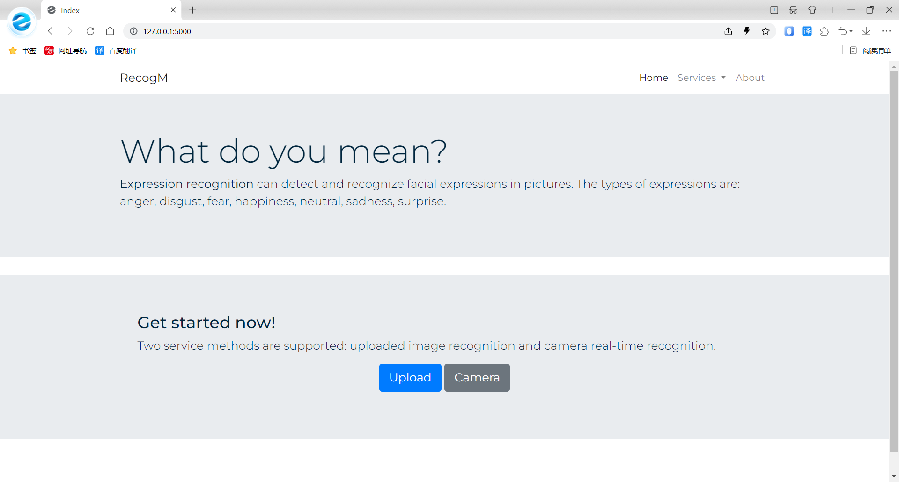
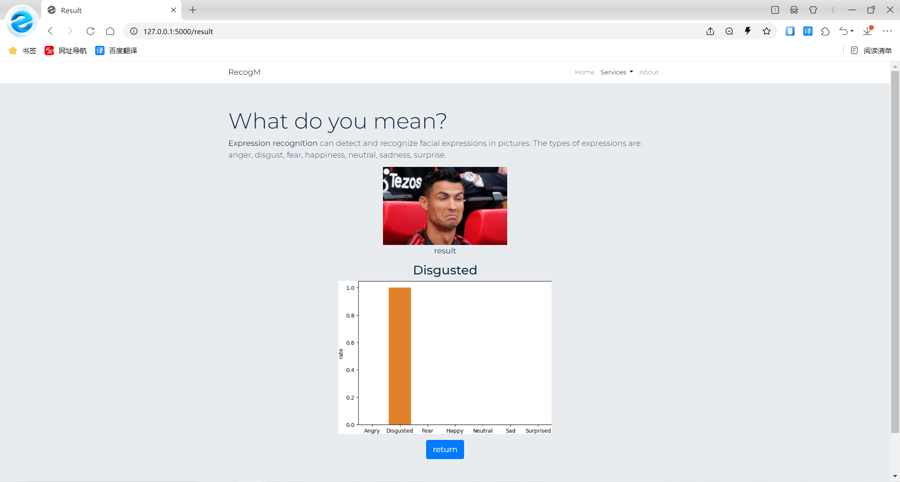

# RecogM

Graduation Project of Facial Expression Recognition Based on Deep Learning
- [Upload](https://github.com/dwu5/RecogM#upload)
- [Camera](https://github.com/dwu5/RecogM#camera)

## Upload
Select a local image to upload for recognition.

In addition to the recognition result, the probability histogram for each category will also be displayed.

## Camera
Turn on the camera to enable recognition.

With haarcascade frontal face detector from OpenCV, faces in the frame will be circled and marked with recognition results.